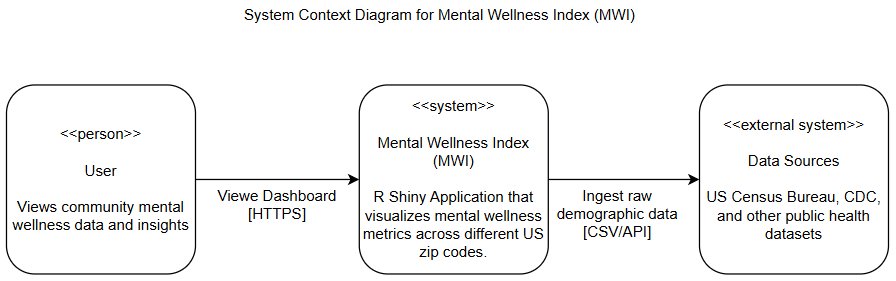
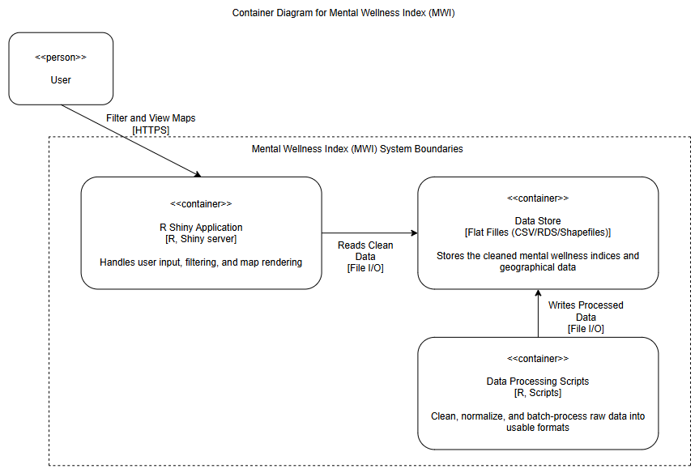
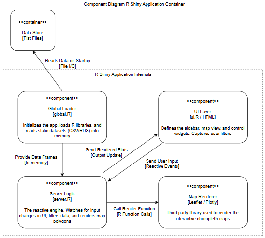

# Architectural Documentation

**Reengineering Task:** Architectural Recovery and Documentation  
**Author:** Danial Adli @danialadli

## Overview
This directory contains the architectural artifacts recovered from the `hse-mwi` legacy system. The system originally did not have any documentation on the high-level architecture, thus this new directory brings the documentation of the system architecture using the **C4 Model**.

For a detailed decision log regarding the architecture, please refer to [ADR-001: Current Architecture](./ADR-001-current-architecture.md).

---

## Level 1: System Context Diagram
The Context Diagram illustrates the **Mental Wellness Index (MWI)** as a visualization tool that aggregates external public health data for researchers and public users.

**Key Insights:**
* The system does not generate primary data; it relies heavily on external ingestion from Census and CDC sources.
* Users interact with the system purely for visualization (Read-only access).

---

## Level 2: Container Diagram
The Container Diagram reveals the high-level software architecture. It highlights that the system is a Monolithic **R Shiny Application** backed by a **Flat-File Data Store**.

**Key Insights:**
* **No SQL Database:** The system uses CSV/RDS files (`/data` folder) as its persistence layer.
* **Offline Processing:** Data cleaning happens via separate R scripts, decoupled from the live application.
* **Tight Coupling:** The Application Logic and Data Store are tightly coupled via direct file I/O.

---

## Level 3: Component Diagram (R Shiny App)
This diagram zooms into the **R Shiny Application** container to visualize the internal "Reactive Graph" pattern used in `app.R`.

**Key Insights:**
* **Global Loader:** `global.R` loads all data into memory on startup, which may present scalability issues as data size grows.
* **Server Logic:** The core business logic resides in `server.R`, which listens to UI inputs and renders Leaflet maps dynamically.

---
